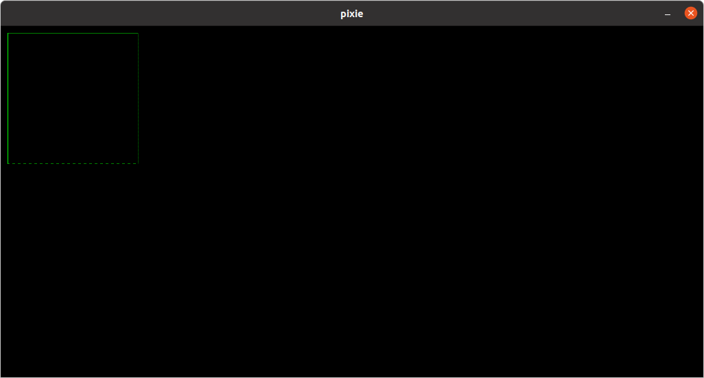

![status.badge] [![language.badge]][language.url] [![standard.badge]][standard.url] [![license.badge]][license.url]

# pixie

pixie is a simple vector display emulator for Linux. You can send
commands to pixie using a named pipe. 

## Changes

~~~
14-Feb-2022  Added support for pages and backgroud "color"
10-Feb-2022  Added the blit mode (XOR or COPY)
09-Feb-2022  Added optional line pattern.
07-Feb-2022  First version.
~~~

## Compile

~~~
make
~~~

## Use

*pixie [--width n] [--height m] [--title s] [pipe]*

 > Default resolution is 1024x512, default title is pixie
 > and default named pipe is `/tmp/pixie.pipe`.

### Example

~~~
pixie --width 330 --height 410 --title Vectrex /tmp/pixie.pipe
~~~

 > When you run pixie it will block the terminal until you press
 > Ctrl+C or send commands to the named pipe. Therefore you will 
 > need to open two terminals: one for pixie and one for sending 
 > commands.

## Commands 

You can send pixie following basic commands

### Pages

`PAGE WRITE n` ... Sets write page (page on which commands draw)

`PAGE DISPLAY n` ... Sets display page (page which is shown)

Default page is one. Pages are dynamically allocated. Pixie allows
up to ten pages.

### Color Commands

`INK c` ... Sets fore color (pen) intensity (0-255)

`PAPER c` ... Set back color (paper) intensity (0-255)

### Screen

`CLS` ... Clear current

`BLIT XOR` ... Set XOR mode for blitting

`BLIT COPY` ... Set normal mode for blitting

Default blitting is copy.

### Drawing

`PIXEL x,y` ... Draws pixel at x,y. Respects blit mode and fore and back colors.

`LINE x0,y0,x1,y1[,pattern]` ... Draws line from x0,y0 to x1,y1. Last parameter is bit pattern i.e. dotted line is 01010101. 

## Example

~~~
echo PAPER 32 > /tmp/pixie.pipe
echo CLS > /tmp/pixie.pipe
echo PAGE WRITE 1 > /tmp/pixie.pipe
echo PAPER 0 >/tmp/pixie.pipe
echo INK 128 > /tmp/pixie.pipe
echo LINE 10,10,200,10 > /tmp/pixie.pipe
echo LINE 200,10,200,200,85 >/tmp/pixie.pipe
echo LINE 200,200,10,200,15 >/tmp/pixie.pipe
echo INK 255 > /tmp/pixie.pipe
echo LINE 10,200,10,10 > /tmp/pixie.pipe
echo PAGE DISPLAY 1 > /tmp/pixie.pipe
~~~

## Using pixie from C

Use standard file functions to write to pixie.

~~~cpp
#include <fcntl.h>
#include <unistd.h>
#include <stdlib.h>
#include <stdarg.h>

#define PIXIE_PIPE          "/tmp/pixie.pipe"
#define MAX_PIXIE_BUFFER    32

static int _fd=0;
static char _buffer[MAX_PIXIE_BUFFER];

void pxopen() {
    if ( (_fd = open(PIXIE_PIPE, O_WRONLY)) < 0)
        exit(1);
}

void pxclose() {
    close(_fd);
}

void pxwrite(const char *format, ...) {
    va_list argptr;
    va_start(argptr, format);
    vsprintf(_buffer, format, argptr);
    write(_fd,_buffer,strlen(_buffer));
    va_end(argptr);
}

void cls() {
    pxwrite("C\n");;
}

void line(int x0,int y0, int x1, int y1) {
    pxwrite("L%d,%d,%d,%d,%d\n",x0,y0,x1,y1,_g.line_style);
}
~~~

## Why pixie?

To simulate procedural programming environment on an event driven GUI. You can, for example, develop vector game prototypes for 8-bit machines on Linux, or test your drawing algorithms on pixie.

## To do

My wish list includes (in this order) raster operations, colors, and a retro CRT shader. Stay tuned.

[language.url]:   https://en.wikipedia.org/wiki/ANSI_C
[language.badge]: https://img.shields.io/badge/language-C-blue.svg

[standard.url]:   https://en.wikipedia.org/wiki/C89/
[standard.badge]: https://img.shields.io/badge/standard-C89-blue.svg

[license.url]:    https://github.com/tstih/libcpm3-z80/blob/main/LICENSE
[license.badge]:  https://img.shields.io/badge/license-MIT-blue.svg

[status.badge]:  https://img.shields.io/badge/status-stable-green.svg